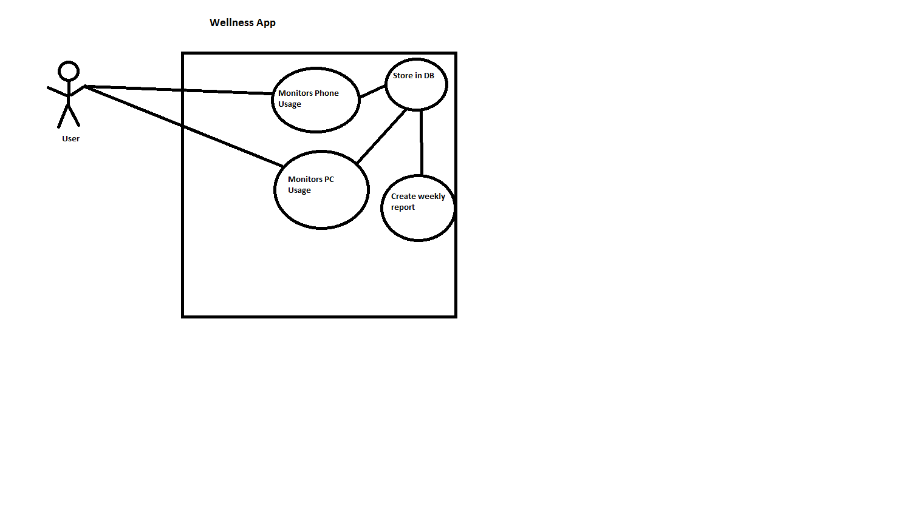

# Wellness App

## Project Abstract:
Create an android phone app that helps to monitor your health. Tracks your daily sleep count, work out frequency, weight, and work. You can set goals that you want to accomplish (work out 3x a week) and track them week by week. Additionally it will keep information in regards to social media usage/phone usage to make sure you aren’t wasting time on that. Each week and month the user will get a rating that is scored based on well they did. Another step can be creating a desktop application that also monitors social media/game usage in order to report on this as well

## Project Relevance:
This project can be developed using the educational goals because it will be developed in Java for Android, so we can use JUnit test driven development to create the product and test each module individually. Using Java we can develop using OOP designing, for example object oriented screens and views. We can create UML to design the app, and show the relationship between different views and fragments. Additionally the user will interact with the app using a GUI, and we can store the user’s data in a DB.

## Requried Resources:
- Android Studio
- Optional: Windows phone
